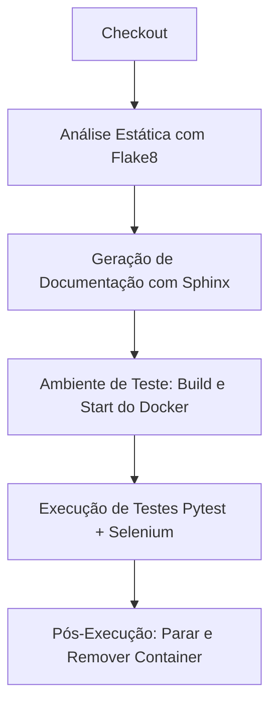

# Dash: Dashboard de Previsão e Análise de Saúde Cardiovascular

Este é um projeto de aplicação interativa desenvolvida em Python com a biblioteca **Plotly Dash**. O objetivo principal é fornecer uma interface gráfica moderna para análise exploratória de dados cardíacos e previsão de risco de doenças cardiovasculares utilizando um modelo de Machine Learning (**XGBoost**).

---

## 🚀 Conceitos Abordados na Construção

Este projeto foi desenhado sob a perspectiva de engenharia de software moderna, combinando práticas robustas de **DevOps** e **Garantia de Qualidade (QA)**. Os pilares de destaque aplicados no projeto são:

1. **Integração Contínua (CI) com Jenkins**: Automatização de todo o fluxo de verificação do código a cada atualização. A pipeline é declarativa e gerencia a lintagem de código, geração de documentação e o disparo de testes automatizados em um ambiente limpo.
2. **Controle de Versão com GitHub**: O fluxo de desenvolvimento utiliza repositórios remotos para versionamento de código, controle de histórico e integração direta de gatilhos (triggers) com a pipeline do Jenkins.
3. **Conteinerização com Docker**: Padronização dos ambientes de desenvolvimento, execução e testes. A aplicação é encapsulada em um container que contém todas as dependências isoladas (incluindo o interpretador Python, dependências do projeto e o Chromium Web Driver para testes).
4. **Testes Automatizados (E2E com Pytest & Selenium)**: Implementação de testes automatizados de ponta a ponta (End-to-End). O Selenium simula interações de um usuário real no navegador (como abrir páginas e verificar elementos dinâmicos) rodando em modo *headless* (sem interface gráfica) na pipeline de testes.

---

## 📁 Estrutura do Projeto

*   `main.py`: Arquivo principal que gerencia o roteamento entre páginas do Dashboard e inicia o servidor do Dash na porta `8081`.
*   `app.py`: Inicializador do objeto da aplicação Dash, carregando os estilos (Bootstrap FLATLY) e configurando os callbacks.
*   `Jenkinsfile`: Pipeline declarativa que descreve as etapas de Checkout, Análise Estática, Geração de Documentação, Construção do Ambiente Docker e Execução de Testes E2E.
*   `Dockerfile`: Define a imagem Docker contendo o Python 3.10, instalação do Chromium/Chromedriver e dependências listadas no `requirements.txt`.
*   `paginas/`:
    *   `formulario.py`: Contém o layout e a lógica que utiliza o modelo de Machine Learning (`modelo_xgboost.pkl` e `medianas.pkl`) para realizar previsões cardíacas com base em 13 fatores preenchidos pelo usuário.
    *   `graficos.py`: Busca dados reais do *UCI Machine Learning Repository* para exibir um histograma e boxplot interativos de idade/doença de pacientes.
*   `tests/`:
    *   `conftest.py`: Fixture do Pytest responsável por inicializar e encerrar de forma limpa o Selenium WebDriver do Chrome.
    *   `test_home.py`: Código dos testes E2E com lógica de verificação inteligente (`wait_for_url`) para garantir que o navegador espere o carregamento do Dash sem causar falhas de inicialização.

---

## 🛠️ Como Executar o Projeto Localmente

### Opção A: Execução Local Direta (Virtualenv)

1. Crie um ambiente virtual e ative-o:
   ```bash
   python3 -m venv .venv
   source .venv/bin/activate
   ```
2. Instale as dependências:
   ```bash
   pip install --upgrade pip
   pip install -r requirements.txt
   ```
3. Execute a aplicação:
   ```bash
   python main.py
   ```
4. Acesse no navegador: `http://127.0.0.1:8081`

### Opção B: Execução Usando Docker

1. Construa a imagem Docker:
   ```bash
   docker build -t dash_test .
   ```
2. Execute o container na porta `8081`:
   ```bash
   docker run -d --name dash_test -p 8081:8081 dash_test:latest
   ```
3. Acesse no navegador: `http://localhost:8081`

---

## 🧪 Pipeline de Testes Automatizados no Jenkins

A pipeline definida no [Jenkinsfile](file:///home/rapha/dash/Jenkinsfile) executa as seguintes fases em cada build:



1.  **Checkout**: Faz o clone do código fonte do GitHub.
2.  **Análise Estática**: Roda o `flake8` para garantir as regras de conformidade e formatação de código Python.
3.  **Inclui Doc**: Gera documentação estática do Sphinx de forma automatizada.
4.  **Ambiente de teste**: Monta a imagem Docker da aplicação e a inicia de maneira isolada na porta `8081`.
5.  **Test**: Executa a bateria de testes unitários e de integração E2E com Selenium (`python -m pytest`) de dentro do container docker criado.
6.  **Post-always**: Desliga (`docker stop`) e limpa o container (`docker rm`), liberando a porta e os recursos da máquina hospedeira do Jenkins de forma limpa.
